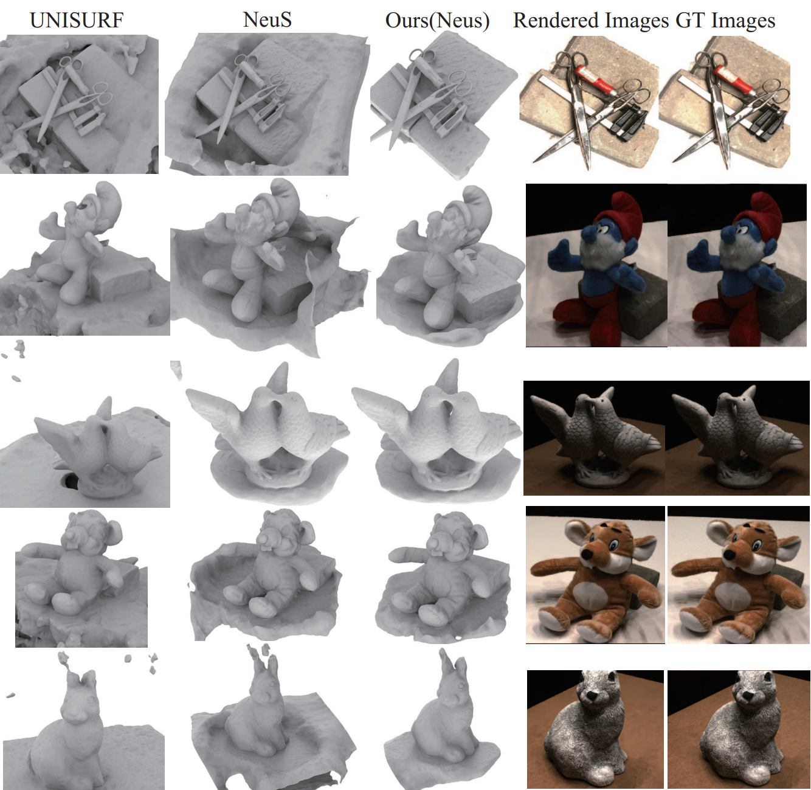

# Towards Better Gradient Consistency for Neural Signed Distance Functions via Level Set Alignment (CVPR 2023)


<h2 align="center"><a href="https://mabaorui.github.io/">Personal Web Pages</a> | <a href="http://arxiv.org/abs/2305.11601/">Paper</a></h2>

This repository contains the code to reproduce the results from the paper.
[Towards Better Gradient Consistency for Neural Signed Distance Functions via Level Set Alignment](http://arxiv.org/abs/2305.11601/).

You can find detailed usage instructions for training your own models and using pretrained models below.

If you find our code or paper useful, please consider citing

    @inproceedings{BaoruiTowards,
        title = {Towards Better Gradient Consistency for Neural Signed Distance Functions via Level Set Alignment},
        author = {Baorui Ma and Junsheng Zhou and Yu-Shen Liu and Zhizhong Han},
        booktitle = {Conference on Computer Vision and Pattern Recognition (CVPR)},
        year = {2023}
    }

## Coming Soon

Related work
```bash
Pytorch 
https://github.com/mabaorui/NeuralPull-Pytorch
Tensorflow
https://github.com/mabaorui/NeuralPull
https://github.com/mabaorui/OnSurfacePrior
https://github.com/mabaorui/PredictableContextPrior
```


## Demo
<p align="left">
  
</p>

<p align="left">
  
</p>


## Installation
First you have to make sure that you have all dependencies in place.
The simplest way to do so, is to use [anaconda](https://www.anaconda.com/). 

You can create an anaconda environment called `tf` using
```
conda env create -f tf.yaml
conda activate tf
```

## ToDo
In different datasets or your own data, because of the variation in point cloud density, this ['0.25' parameter](https://github.com/mabaorui/OnSurfacePrior/blob/d53bf3a7bc88837e2974ddc1fd0700ecc2641ade/onSurPrior.py#L425) has a very strong influence on the final result, which controls the distance between the query points and the point cloud. So if you want to get better results, you should adjust this parameter. We give '0.25' here as a reference value, and this value can be used for most object-level reconstructions. For the scene dataset, we will later publish the reference values for the hyperparameter settings for the scene dataset.
